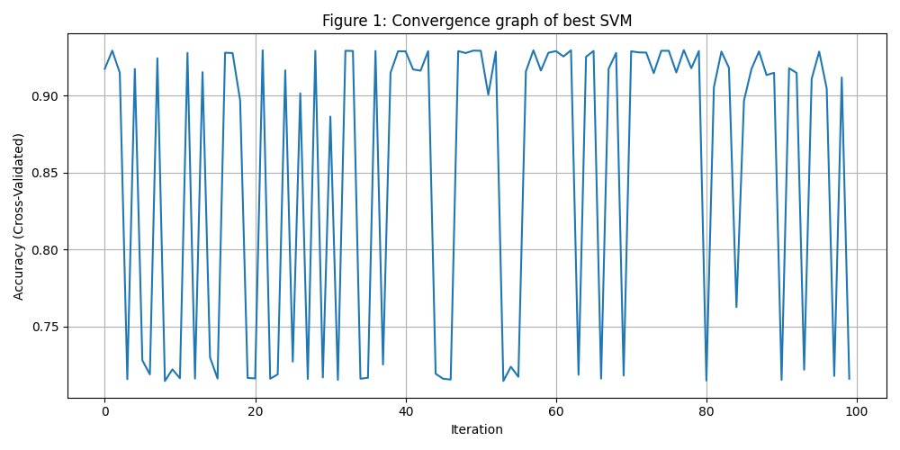

# svm-parameter-optimization
# 🔍 SVM Hyperparameter Optimization on Dry Bean Dataset

## 📌 Objective
This project performs **Support Vector Machine (SVM)** classification on the Dry Bean Dataset by optimizing its hyperparameters using **RandomizedSearchCV**. The goal is to:

- Improve accuracy via hyperparameter tuning  
- Analyze convergence patterns  
- Identify the best-performing model configuration  

---

## 🧪 Methodology

### 1. Dataset
The **Dry Bean Dataset** contains 16 numerical features describing the shape and size of beans. The target column (`Class`) identifies the type of bean.

### 2. Preprocessing
- **Label Encoding**: The target variable (`Class`) was encoded into numeric labels.
- **Feature Scaling**: All feature columns were standardized using `StandardScaler` to ensure fair comparison across features.

### 3. Model & Optimization
A baseline SVM classifier (`SVC`) was optimized using `RandomizedSearchCV` over the following hyperparameter space:

| Parameter | Values |
|-----------|--------|
| `C`       | Continuous uniform distribution (0.1 to 10) |
| `kernel`  | `['rbf', 'poly', 'sigmoid']` |
| `gamma`   | `['scale', 'auto']` |

- **Search Method**: 100 random combinations per sample  
- **Cross-Validation**: 3-fold CV to ensure stability

### 4. Multiple Samples for Robustness
The optimization process was repeated **10 times** with different random shuffles and train-test splits to verify model robustness.

For each sample:
- Data was shuffled and split (70% train, 30% test)
- Hyperparameters were tuned via `RandomizedSearchCV`
- The best model was evaluated on the test set
- Accuracy and chosen hyperparameters were recorded

---

## 📊 Result Table

| Sample | Accuracy (%) | Best Parameters |
|--------|---------------|-----------------|
| S1     | e.g., 92.33   | `{'C': 4.89, 'kernel': 'rbf', 'gamma': 'scale'}` |
| S2     | ...           | ... |
| ...    | ...           | ... |
| S10    | e.g., 93.12   | `{'C': 3.24, 'kernel': 'poly', 'gamma': 'auto'}` |

> 🔽 This table is saved in `svm_results.csv`.

The highest test accuracy achieved across all 10 samples is identified and further analyzed in the result graph.

---

## 📈 Result Graph: Convergence Plot

- **X-axis**: Iteration number (1 to 100 hyperparameter combinations)  
- **Y-axis**: Cross-validated accuracy during tuning  
- The plot shows how accuracy improved (or plateaued) as better parameter combinations were tested.
- It helps visualize the performance and effectiveness of the tuning process for the best-performing sample.

---

## ✅ Conclusion

- SVM performance significantly varies with hyperparameters.  
- `RandomizedSearchCV` effectively finds optimal parameter combinations without exhaustive search.  
- This project emphasizes the importance of tuning and repeatability in machine learning model selection.

---

